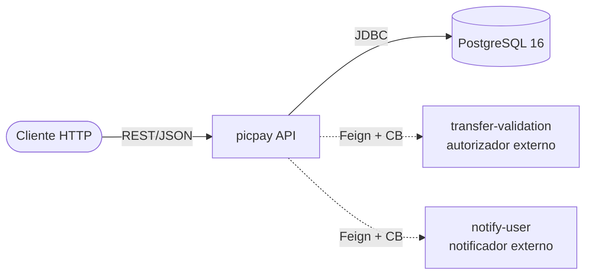

# PicPay Simplificado

API REST em Spring Boot que implementa o desafio "PicPay Simplificado": uma plataforma de pagamentos enxuta com cadastro de usuários, autenticação JWT e transferências entre carteiras, com autorizador externo, notificação assíncrona e proteção contra race conditions.
A solução adota arquitetura hexagonal por feature module, persistência em PostgreSQL com migrations Flyway, circuit breakers via Resilience4j e suíte de testes que inclui unidade, integração (Testcontainers + WireMock) e mutation testing (PIT).

**Enunciado original do desafio:** [PicPay/picpay-desafio-backend](https://github.com/PicPay/picpay-desafio-backend)

---

## Sobre o desafio

O PicPay Simplificado é uma plataforma de pagamentos enxuta. Existem **dois tipos de usuário**:

- **Comuns** — depositam, recebem e enviam dinheiro.
- **Lojistas (`MERCHANT`)** — depositam e recebem, mas **não enviam**.

### Regras de negócio

1. Cadastro requer **nome completo, documento (CPF/CNPJ), e-mail e senha**. Documento e e-mail são únicos no sistema.
2. Usuários comuns enviam dinheiro para outros comuns ou para lojistas.
3. Lojistas só **recebem** transferências.
4. Saldo é validado antes de qualquer transferência.
5. Antes de finalizar, a transferência é submetida a um **autorizador externo** (mock).
6. A transferência é **transacional** — qualquer falha (validador nega, serviço externo cai, exceção inesperada) faz o dinheiro voltar para a carteira do remetente.
7. No recebimento, o destinatário recebe **notificação** via serviço externo de terceiros — possivelmente instável.
8. A API é **RESTful**.

### Endpoint contratado vs. proposta implementada

O enunciado sugere o contrato:

```http
POST /transfer
Content-Type: application/json

{
  "value": 100.0,
  "payer": 4,
  "payee": 15
}
```

A implementação propõe um contrato mais aderente a REST e a segurança:

```http
POST /api/v1/users/{user_id}/transfer
Authorization: Bearer <jwt>
Content-Type: application/json

{
  "target_id": "f1a2b3c4-…",
  "value": 100.00,
  "description": "almoço"
}
```

**Diferenças intencionais:**

- Remetente identificado por path (`{user_id}`) e — quando o filtro de auth estiver ativo — validado contra o `sub` do JWT, em vez de aceitar o `payer` como input do corpo.
- Identificação por **UUID** (`external_id` do usuário), não por id numérico interno do banco.
- Adiciona `description` para auditabilidade da transferência.
- Resposta inclui `sent_date` (timestamp) e mensagem de confirmação.

---

## Status dos requisitos

| # | Requisito | Status | Onde |
|---|---|---|---|
| 1 | Cadastro com nome, documento, e-mail, senha; documento e e-mail únicos | ✅ | `POST /api/v1/users` + `EmailAlreadyRegisteredException` (409) + `DocumentAlreadyRegisteredException` (409) |
| 2 | Comuns podem enviar para comuns e para lojistas | ✅ | `TransferUseCaseImpl` |
| 3 | Lojistas só recebem | ✅ | `UserCantTransferException` (412) quando `MERCHANT` tenta enviar |
| 4 | Validação de saldo antes da transferência | ✅ | `InsufficientBalanceException` (412) + constraint `CHECK (balance >= 0)` |
| 5 | Consulta a autorizador externo antes de finalizar | ✅ | `TransferValidationGateway` (Feign + Resilience4j) |
| 6 | Transferência transacional com rollback | ✅ | `@Transactional` + `@Modifying` JPQL + ADR-0003 |
| 7 | Notificação ao destinatário via serviço externo (instável) | ✅ | `NotifyUserGateway` com circuit breaker; falha é best-effort |
| 8 | API RESTful | ✅ | Recursos por URL, verbos HTTP corretos, status codes coerentes |
| — | Autenticação JWT (proposta extra) | ⚠️ | Geração no login funciona; **filtro de auth ainda não está ativo** (`SecurityConfiguration` usa `permitAll()`) |
| — | Endpoint de depósito | ❌ | Não implementado. Saldo só pode ser pré-populado via banco. |
| — | Endpoints de consulta (saldo, lista de transações) | ❌ | Fora do escopo mínimo do desafio. |
| — | Documentação técnica completa (arquitetura, API, testes, ADRs) | ✅ | [doc/](doc/README.md) |
| — | Testes (unidade, adapter, integração, mutation) | ✅ | JUnit 5 + Mockito + Testcontainers + WireMock + JaCoCo + PIT |
| — | CI | ✅ | GitHub Actions (`ci.yml`) — testes unitários e de integração |

---

## Quickstart

### Modo desenvolvimento (app local + Postgres em container)

```bash
docker compose up -d postgres
./gradlew bootRun
```

### Modo full container (app + Postgres juntos)

```bash
docker compose up -d
```

- Swagger UI: <http://localhost:8080/swagger-ui.html>
- Postgres: `localhost:5433` (db `picpay`, usuário/senha `postgres/postgres`)

Comandos completos, variáveis de ambiente e troubleshooting em [doc/DEVELOPMENT.md](doc/DEVELOPMENT.md).

---

## Endpoints

| Método | Path | Função |
|---|---|---|
| `POST` | `/api/v1/users` | Cria um usuário (`COMMON` ou `MERCHANT`). Retorna `201 Created` com `Location`. |
| `POST` | `/api/v1/auth/login` | Autentica e retorna JWT (HS512, TTL 600s). |
| `POST` | `/api/v1/users/{user_id}/transfer` | Envia uma transferência. Retorna `200 OK` com `sent_date` + mensagem. |

Especificação completa de payloads, validações e respostas em [doc/DOCUMENTATION.md §5](doc/DOCUMENTATION.md#5-endpoints). Mapeamento de erros HTTP em [§4](doc/DOCUMENTATION.md#4-erros-http).

---

## Stack

| Camada | Bibliotecas |
|---|---|
| **Linguagem & framework** | Java 21, Spring Boot 3.2.6, Spring Cloud 2023.0.0 |
| **Persistência** | Spring Data JPA + Hibernate, Flyway, PostgreSQL 16 |
| **Segurança** | Spring Security, `com.auth0:java-jwt` 4.5.1, BCrypt |
| **HTTP & resiliência** | OpenFeign, Resilience4j circuit breaker |
| **Validação** | Bean Validation (`jakarta.validation`) |
| **Documentação OpenAPI** | springdoc-openapi 2.5.0 (Swagger UI) |
| **Testes** | JUnit 5, Mockito, AssertJ, Testcontainers, WireMock 3.10 |
| **Qualidade** | JaCoCo 0.8.12 (linhas), PIT 1.17.4 (mutation testing) |
| **Build & infra** | Gradle Kotlin DSL, Docker Compose, GitHub Actions |

---

## Arquitetura

**Hexagonal por feature module.** Cada feature (`user`, `transaction`) tem suas próprias camadas (`domain/`, `usecases/`, `adapter/`); dependências sempre apontam para dentro. Pacote `common/` agrupa o que cruza features.



Linhas tracejadas = dependências externas protegidas por circuit breaker. Estrutura de pacotes detalhada, fluxos críticos com diagramas de sequência e diagrama de classes em [doc/ARCHITECTURE.md](doc/ARCHITECTURE.md).

---

## Decisões em destaque

Cada decisão tem ADR completo com contexto, alternativas consideradas e consequências:

- **[ADR-0001](doc/adr/0001-arquitetura-hexagonal.md)** — Arquitetura hexagonal por feature module (domínio puro, regra de dependência inward).
- **[ADR-0002](doc/adr/0002-circuit-breaker-por-client-externo.md)** — Circuit breaker por client externo (Resilience4j); fallback do autorizador retorna `DENIED` por segurança, fallback do notificador é no-op.
- **[ADR-0003](doc/adr/0003-atomic-balance-update-via-jpql.md)** — Atualização atômica de saldo via JPQL `@Modifying` + constraint `CHECK (balance >= 0)`. Suportado por teste de concorrência com 10 threads.
- **[ADR-0004](doc/adr/0004-testes-com-object-mother-pattern.md)** — Object Mother pattern (Martin Fowler) para fixtures de teste.

---

## Documentação

A documentação técnica está em [doc/](doc/README.md):

| Documento | Para quê |
|---|---|
| [doc/ARCHITECTURE.md](doc/ARCHITECTURE.md) | Arquitetura hexagonal, estrutura de pacotes, fluxos críticos, diagramas Mermaid. |
| [doc/DOCUMENTATION.md](doc/DOCUMENTATION.md) | Referência da API: stack, schema, erros HTTP, endpoints. |
| [doc/TESTS.md](doc/TESTS.md) | Estratégia de testes, Object Mother, JaCoCo, PIT, integração. |
| [doc/DEVELOPMENT.md](doc/DEVELOPMENT.md) | Setup local, comandos, profiles, Docker, troubleshooting. |
| [doc/adr/](doc/adr/) | Architecture Decision Records. |
