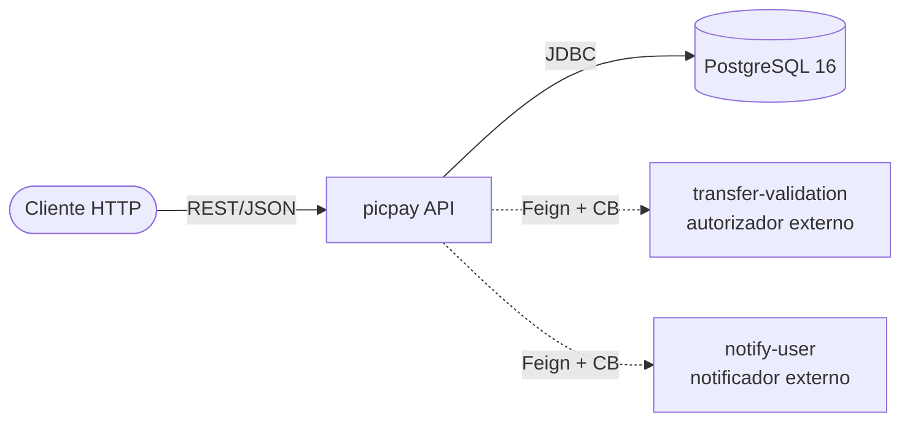
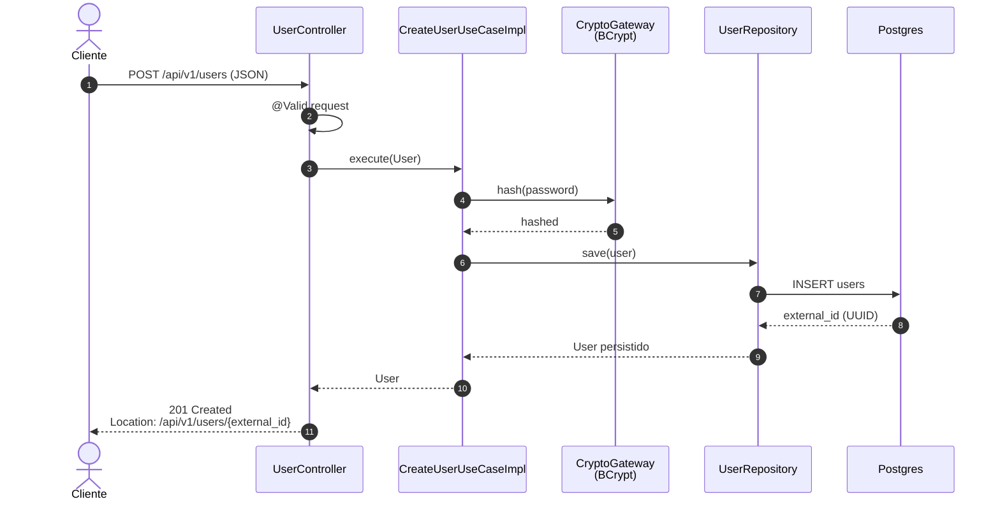
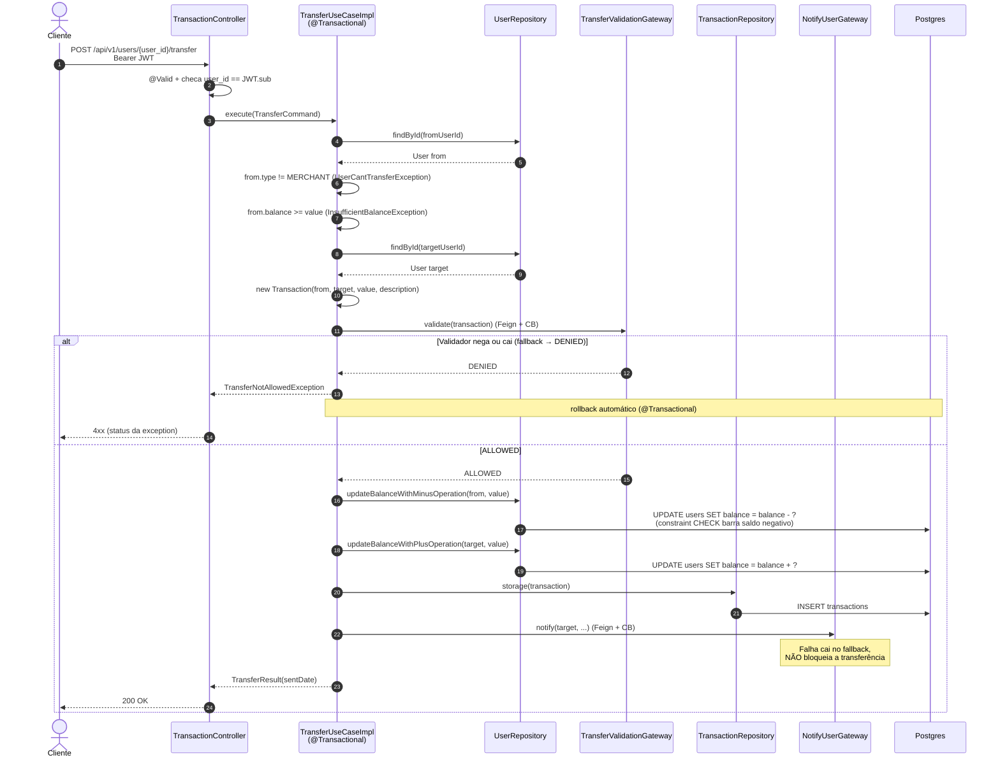
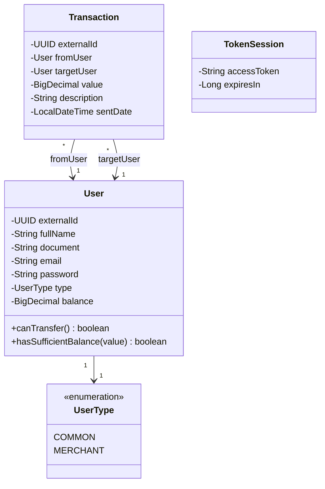

# Arquitetura

## 1. Visão geral

Aplicação de transferências P2P estilo PicPay simplificado. Dois atores: usuários **COMMON** (podem enviar e receber) e **MERCHANT** (só recebem). O fluxo principal é uma transferência: validação de saldo → autorização externa → débito atômico → crédito atômico → notificação assíncrona.

**Stack resumida:** Java 21, Spring Boot 3.2.6, Spring Cloud 2023.0.0 (OpenFeign + Resilience4j), Spring Data JPA, Flyway, PostgreSQL 16, Spring Security + `com.auth0:java-jwt`, springdoc-openapi.

### Diagrama de contexto



Linhas tracejadas representam dependências externas protegidas por circuit breaker (Resilience4j). Notificações são best-effort — falhas não bloqueiam a transferência (ver §4.3).

---

## 2. Estrutura de pacotes

```
picpay-simplificado/src/main/java/com/wastecoder/picpay/
├── PicpaySimplificadoApplication.java   ← @SpringBootApplication, @EnableFeignClients
├── user/                                ← feature: cadastro, login, JWT
│   ├── domain/
│   │   ├── model/                       User, TokenSession (puros, sem Spring/JPA)
│   │   ├── enums/                       UserType (COMMON, MERCHANT)
│   │   ├── exceptions/                  *Exception extends ApplicationException
│   │   ├── viewmodels/                  LoginUserCommand, LoginUserResult (records)
│   │   └── ports/
│   │       ├── input/                   CreateUserUseCase, LoginUserUseCase
│   │       └── output/                  UserRepository, CryptoGateway, TokenGateway, NotifyUserGateway
│   ├── usecases/                        CreateUserUseCaseImpl, LoginUserUseCaseImpl (@Service)
│   └── adapter/
│       ├── controller/                  UserController, AuthController + request/response records
│       ├── repository/                  UserRepositoryImpl + database/UserEntityDatabase + entity/UserEntity + mapper/
│       ├── client/                      NotifyUserClient (@FeignClient) + NotifyUserGatewayImpl
│       ├── crypto/                      BCryptGatewayImpl
│       └── token/                       TokenGatewayImpl
├── transaction/                         ← feature: transferências
│   ├── domain/
│   │   ├── model/                       Transaction
│   │   ├── exceptions/                  InsufficientBalanceException, TransferNotAllowedException, ...
│   │   ├── viewmodels/                  TransferCommand, TransferResult, TransferValidationResult
│   │   └── ports/
│   │       ├── input/                   TransferUseCase
│   │       └── output/                  TransactionRepository, TransferValidationGateway
│   ├── usecases/                        TransferUseCaseImpl
│   └── adapter/
│       ├── controller/                  TransactionController + request/response records
│       ├── client/                      TransferValidationClient (@FeignClient) + TransferValidationGatewayImpl
│       └── repository/                  TransactionRepositoryImpl + database/TransactionEntityDatabase + entity/TransactionEntity + mapper/
└── common/                              ← cruza features
    ├── domain/
    │   ├── exceptions/                  ApplicationException extends ResponseStatusException
    │   └── utils/                       UuidUtils
    └── adapter/
        ├── clock/                       ClockConfiguration (@Bean Clock)
        ├── repository/                  AbstractJpaPersistable<Long> (id, createdAt, updatedAt)
        └── controller/
            ├── GlobalExceptionHandler   @RestControllerAdvice
            ├── response/                ErrorResponse
            └── security/                JwtTokenConfiguration, SecurityConfiguration
```

### Suffix → Papel → Localização

A convenção de nomes carrega informação. O sufixo do arquivo já diz qual o papel dele na arquitetura:

| Suffix | Papel | Localização                                   |
|---|---|-----------------------------------------------|
| `*UseCase` | Input port (interface) | `domain/ports/input/`                         |
| `*UseCaseImpl` | Implementação do use case (`@Service`) | `usecases/`                                   |
| `*Repository`, `*Gateway` | Output port (interface) | `domain/ports/output/`                        |
| `*RepositoryImpl`, `*GatewayImpl` | Implementação do output port | `adapter/repository/` ou `adapter/<concern>/` |
| `*Client` | Interface Feign (contrato HTTP cru) | `adapter/client/`                             |
| `*Database` | `JpaRepository` do Spring Data | `adapter/repository/database/`                |
| `*Entity` | Entidade JPA | `adapter/repository/entity/`                  |
| `*Command`, `*Result` | DTO (record) cruzando a fronteira de port | `domain/viewmodels/`                          |
| `*Request`, `*Response` | DTO HTTP com helpers `toCommand()` / `toModel()` | `adapter/controller/request/response/`        |

---

## 3. Decisões arquiteturais

- **Hexagonal por feature module**
  - Cada feature (`user`, `transaction`) tem suas próprias camadas (`domain/`, `usecases/`, `adapter/`).
  - Dependências apontam só para dentro: `adapter/` → `domain/`, nunca o contrário.
  - Ver [adr/0001-arquitetura-hexagonal.md](adr/0001-arquitetura-hexagonal.md).
- **Domínio puro**
  - Modelos, ports e exceptions no pacote `domain/` não importam Spring nem JPA.
  - Garante que regra de negócio é testável sem subir contexto.
- **Identidade dupla — `id` interno + `external_id` UUID**
  - `Long bigserial` é a chave do banco (eficiente para FK e índice).
  - `UUID external_id` é o que cruza a fronteira da aplicação (URLs, JWT `sub`, requests).
  - Mappers em `adapter/repository/mapper/` traduzem e mantêm o `id` interno isolado.
- **Erros via `ApplicationException`**
  - Toda exceção de regra de negócio estende `ApplicationException extends ResponseStatusException`, então carrega o `HttpStatus` certo.
  - O `GlobalExceptionHandler` (`@RestControllerAdvice`) padroniza o corpo de erro e ainda intercepta validação de bean (`MethodArgumentNotValidException`), JSON malformado e exceções não previstas.
- **Circuit breaker por client externo**
  - Cada `*GatewayImpl` que envolve um Feign client tem `@CircuitBreaker(name = "<n>", fallbackMethod = "...")` e um fallback que loga e retorna padrão seguro.
  - Config em `application-docker.yml` sob `resilience4j.circuitbreaker.instances.<n>` casando com `spring.cloud.openfeign.client.config.<n>`.
  - Instâncias atuais: `notify-user`, `transfer-validation`.
  - Ver [adr/0002-circuit-breaker-por-client-externo.md](adr/0002-circuit-breaker-por-client-externo.md).
- **Atualização atômica de saldo via JPQL `@Modifying`**
  - `UserEntityDatabase.updateBalanceWithMinusOperation` / `updateBalanceWithPlusOperation` rodam UPDATE direto no banco — não read-modify-write na aplicação.
  - Combinado com a constraint `CHECK (balance >= 0)` no DDL, transferências concorrentes não conseguem furar o saldo.
  - Ver [adr/0003-atomic-balance-update-via-jpql.md](adr/0003-atomic-balance-update-via-jpql.md).
- **Migrations versionadas com Flyway**
  - `spring.jpa.hibernate.ddl-auto=validate` — schema só muda por novo `V{n}__*.sql`, nunca por auto-DDL.
  - Postgres-específico: `V1` cria o enum `user_type`, mapeado em `UserEntity` via `@JdbcTypeCode(SqlTypes.NAMED_ENUM)`.

---

## 4. Fluxos críticos

### 4.1 Criar usuário

`UserController.create` → `CreateUserUseCaseImpl`:
1. Recebe `CreateUserRequest` → converte para `User` (modelo de domínio) com `validate()` no construtor.
2. Hash da senha via `CryptoGateway` (BCrypt).
3. Persiste via `UserRepository` (mapper traduz para `UserEntity`).
4. Retorna `external_id` (UUID) no header `Location`.



### 4.2 Login

`AuthController.login` → `LoginUserUseCaseImpl`: busca usuário por email, valida senha (BCrypt), gera JWT via `TokenGateway`. Detalhes de payload e expiração estão em [DOCUMENTATION.md](DOCUMENTATION.md#52-autenticação).

### 4.3 Transferência

Fluxo principal do sistema. Combina três decisões críticas: validação externa, débito/crédito atômicos e notificação não-bloqueante.



Pontos de atenção:
- **`execute` é `@Transactional`.**
  - Toda a operação roda numa transação única — qualquer exceção entre o débito, o crédito e o `storage` da transação dispara rollback automático.
  - Combinado com os UPDATEs JPQL atômicos e a constraint `CHECK (balance >= 0)`, transferências concorrentes do mesmo remetente são serializadas pelo banco e não furam o saldo.
  - Ver [adr/0003-atomic-balance-update-via-jpql.md](adr/0003-atomic-balance-update-via-jpql.md).
- **`notify-user` é best-effort.**
  - Se o serviço externo cair, o circuit breaker abre, o fallback loga e a transferência segue.
  - O usuário recebeu o dinheiro mesmo sem notificação.
  - Cuidado: como o `notify` está dentro do `@Transactional`, uma exceção *não tratada* pelo fallback ainda causaria rollback.
- **`transfer-validation` é bloqueante.**
  - O fallback de `TransferValidationGatewayImpl` retorna `DENIED` quando o serviço cai — por segurança, transferência negada equivale a serviço indisponível.

---

## 5. Diagrama de classes (domínio)

Apenas o núcleo (`domain/`), sem adapters:



Modelos têm `@Getter @Builder(toBuilder=true)`, campos finais e um `validate()` privado chamado no construtor que dispara `ApplicationException(BAD_REQUEST, ...)` quando algo está fora do contrato.

---

## 6. Referências

- [DOCUMENTATION.md](DOCUMENTATION.md) — especificação dos endpoints HTTP.
- [TESTS.md](TESTS.md) — estratégia de testes e como cada camada é coberta.
- [DEVELOPMENT.md](DEVELOPMENT.md) — setup local e comandos.
- ADRs (Architecture Decision Records):
  - [0001-arquitetura-hexagonal.md](adr/0001-arquitetura-hexagonal.md)
  - [0002-circuit-breaker-por-client-externo.md](adr/0002-circuit-breaker-por-client-externo.md)
  - [0003-atomic-balance-update-via-jpql.md](adr/0003-atomic-balance-update-via-jpql.md)
  - [0004-testes-com-object-mother-pattern.md](adr/0004-testes-com-object-mother-pattern.md)
